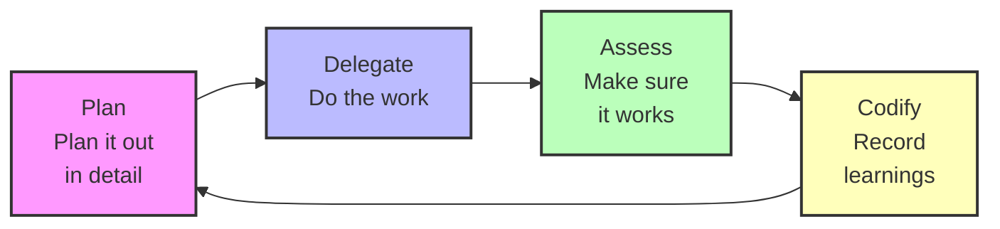

# Every Marketplace

The official Every marketplace where engineers from Every.to share their workflows. Currently featuring the Compounding Engineering Philosophy plugin.

## Quick start

Run Claude and add the marketplace:

```
/plugin marketplace add EveryInc/every-marketplace
```

Then install the plugin:

```
/plugin install compounding-engineering
```

## Available plugins

### Compounding engineering

AI-powered development tools that get smarter with every use. Includes 21 specialized agents, 24 commands, five workflows, and two automated hooks.

**Features:**
- Code review with multiple expert perspectives
- Automated testing and bug reproduction
- PR management and parallel comment resolution
- Documentation generation and maintenance
- Security, performance, and architecture analysis

**Philosophy:**

Each unit of engineering work makes subsequent units of work easier—not harder.



1. **Plan** → Break down tasks with clear steps
2. **Delegate** → Execute with AI assistance
3. **Assess** → Test thoroughly and verify quality
4. **Codify** → Record learnings for next time

[View plugin details](./plugins/compounding-engineering/README.md)
